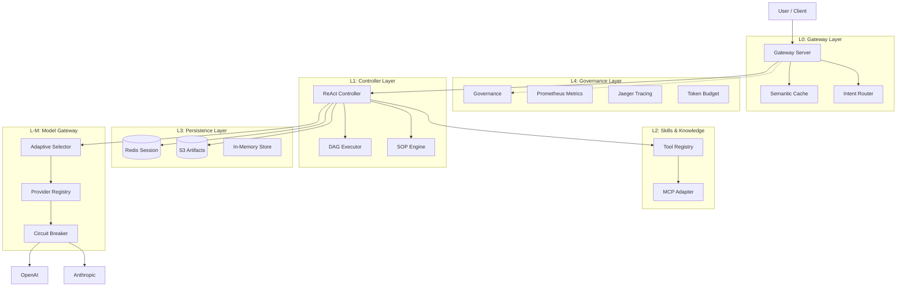

# MutilAgent: Advanced Multi-Agent AI System

[](https://opensource.org/licenses/MIT)
[](https://www.rust-lang.org)
[](https://github.com/yourusername/MutilAgent/actions)
[](Dockerfile)
[](CONTRIBUTING.md)

MutilAgent is a production-grade, layered AI agent framework built in Rust. It is designed for high-performance orchestration of LLM capabilities, supporting multi-modal inputs, autonomous reasoning (ReAct), complex workflow automation (DAG/SOP), and robust enterprise features like semantic caching and circuit breakers.

## 🚀 Key Capabilities

### 🧠 Intelligence Layer
- **Autonomous Agents**: Uses the ReAct (Reason+Act) pattern to solve complex, multi-step problems.
- **Workflow Orchestration**: Supports parallel execution of tasks via DAGs and Standard Operating Procedures (SOPs) defined in YAML.
- **Adaptive Model Selection**: dynamically routes requests to the best LLM (e.g., GPT-4o, Claude 3.5 Sonnet) based on complexity and cost.

### ⚡ Performance & Scalability
- **Semantic Caching**: Vector-embedding based caching (using `text-embedding-3-small`) to serve repeated queries instantly.
- **Tiered Storage**: Hybrid storage system using In-Memory (fast), Redis (state persistence), and S3 (large artifacts).
- **Circuit Breaker**: Automatic failure detection and isolation for LLM providers to prevent cascading system failures.

### 👁️ Multi-Modal Support
- **Vision**: Ingest and process images for visual reasoning.
- **Audio**: Integrated Whisper support for speech-to-text transcription.
- **MCP Host**: Full support for the Model Context Protocol (MCP) to connect external tools and data sources.

## 🏗️ Architecture

MutilAgent follows a strict 5-layer architecture to ensure separation of concerns and scalability.



### Layer Breakdown

1.  **L0 - Gateway**: Handles HTTP requests, authentication, and fast Semantic Caching. Routes intents to the appropriate controller.
2.  **L1 - Controller**: The brain of the agent. Manages the ReAct loop, executes DAGs, and maintains session state.
3.  **L2 - Skills**: Registry of available tools (Calculator, Search, Vision) and MCP connections.
4.  **L3 - Persistence**: Manages data. Sessions stored in Redis, huge files in S3.
5.  **L4 - Governance**: Observability (Metrics, Tracing) and Safety (Token Budgets).
6.  **L-M - Model Gateway**: Abstraction over LLM providers with failover and circuit breaking.

## 🛠️ Getting Started

### Prerequisites
- **Rust**: 1.75+
- **Docker**: For running dependencies (Redis, Jaeger)
- **API Keys**: OpenAI or Anthropic key.

### Environment Setup

Create a `.env` file (or set variables):

```bash
# LLM Providers
OPENAI_API_KEY=sk-...
ANTHROPIC_API_KEY=sk-...

# Persistence (Optional, defaults to Memory)
REDIS_URL=redis://localhost:6379
AWS_ACCESS_KEY_ID=minio
AWS_SECRET_ACCESS_KEY=minio123
AWS_REGION=us-east-1
S3_BUCKET=mutilagent-artifacts
S3_ENDPOINT=http://localhost:9000

# Observability
OTEL_EXPORTER_OTLP_ENDPOINT=http://localhost:4317
```

### Running Locally

1.  **Start Infrastructure** (Redis, MinIO, Jaeger):
    ```bash
    docker-compose up -d
    ```

2.  **Run the Agent**:
    ```bash
    cargo run
    ```
    The server listens on `http://0.0.0.0:3000`.

3.  **Run Tests**:
    ```bash
    cargo test --workspace
    ```

## 📖 Usage Examples

### 1. Chat (ReAct Agent)
Solve a complex problem using reasoning.

```bash
curl -X POST http://localhost:3000/v1/chat \
  -H "Content-Type: application/json" \
  -d '{
    "message": "Write a Python script to scrape a website and save it to a file, then explain how it works."
  }'
```

### 2. Fast Intent (Direct Tool)
Quick lookup bypassing the heavy reasoning loop.

```bash
curl -X POST http://localhost:3000/v1/intent \
  -H "Content-Type: application/json" \
  -d '{
    "message": "Calculate 123 * 456"
  }'
```

### 3. Check Health & Metrics
```bash
curl http://localhost:3000/health
curl http://localhost:3000/metrics
```

## 📂 Project Structure

- `crates/core`: Shared traits and types (`LlmClient`, `AgentResult`).
- `crates/gateway`: Axum server, Semantic Cache, Router.
- `crates/controller`: ReAct loop, DAG Executor, SOP Engine.
- `crates/skills`: Tool definitions, MCP Adapter.
- `crates/model_gateway`: LLM Provider integration, Circuit Breaker.
- `crates/store`: Redis and S3 implementations.
- `crates/governance`: Prometheus metrics, OpenTelemetry tracing.

## 📄 License

This project is licensed under the **MIT License**.

You are free to use, modify, and distribute this software under the terms of the license. See the [LICENSE](LICENSE) file for more details.

### Summary of the MIT License
- **Permissions**: Commercial use, Modification, Distribution, Private use.
- **Limitations**: Liability, Warranty.
- **Conditions**: License and copyright notice.

Copyright (c) 2024 MutilAgent Contributors
